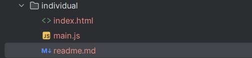
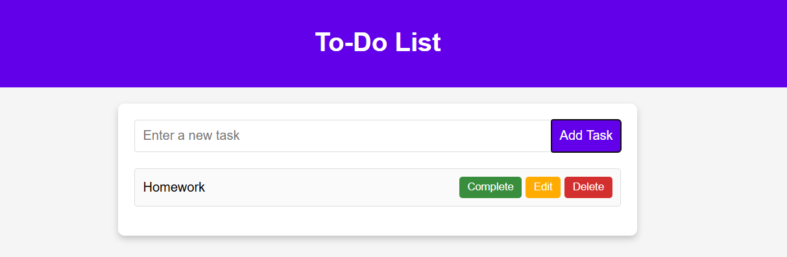
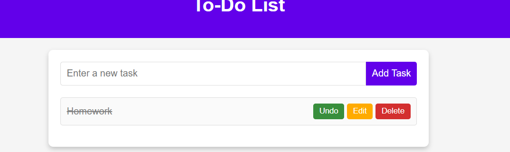
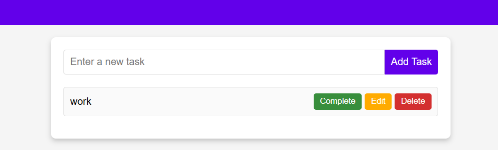
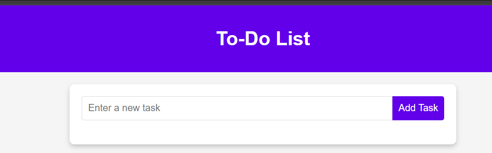

# To-Do List

Простой и удобный список задач, реализованный на чистом JavaScript с поддержкой добавления, 
редактирования, удаления и отметки выполнения задач. Интерфейс адаптивен и подходит для 
использования на разных устройствах.

## Возможности: 

- Добавление новых задач
- Редактирование текста задач
- Удаление задач
- Отметка задач как выполненные / невыполненные
- Сохраняется в оперативной памяти (без серверной части)
- Валидация пользовательского ввода
- Адаптивный и современный интерфейс

## Структура проекта


### Добавление новых задач
Когда пользователь отправляет форму, создается новый объект задачи и добавляется в массив todos.
После этого список задач обновляется с помощью renderTodos() и новая задача появляется на экране.
```js
todoForm.addEventListener('submit', function(event) {
    event.preventDefault();
    const taskText = todoInput.value.trim();
    if (!taskText) {
        alert('Task cannot be empty!');
        return;
    }
    const newTask = {
        id: Date.now(),
        text: taskText,
        completed: false
    };
    todos.push(newTask);
    todoInput.value = '';
    renderTodos();
});
```

### Редактирование текста задач
Нажатие на кнопку "Edit" вызывает диалоговое окно prompt, в котором пользователь может изменить текст задачи. 
После подтверждения текст обновляется и задачи перерисовываются
```js
editButton.addEventListener('click', () => editTask(task.id));

function editTask(id) {
    const task = todos.find(task => task.id === id);
    const newText = prompt('Edit your task:', task.text);

    if (newText !== null && newText.trim() !== '') {
        task.text = newText.trim();
        renderTodos();
    }
}
```

### Удаление задач
После подтверждения удаления задача исключается из массива todos с помощью метода filter. Затем происходит
повторный рендер задач без удалённого элемента.
```js
deleteButton.addEventListener('click', () => deleteTask(task.id));

function deleteTask(id) {
    if (confirm('Are you sure you want to delete this task?')) {
        todos = todos.filter(task => task.id !== id);
        renderTodos();
    }
}
```

### Отметка задач как выполненные / невыполненные
При нажатии на кнопку "Complete" у задачи переключается значение completed. Это визуально отражается стилем 
(зачёркнутый текст), а кнопка меняет надпись на "Undo".
```js
completeButton.addEventListener('click', () => toggleComplete(task.id));

function toggleComplete(id) {
    todos = todos.map(task => task.id === id ? { ...task, completed: !task.completed } : task);
    renderTodos();
}
```

### Сохраняется в оперативной памяти (без серверной части)
Все задачи хранятся в переменной todos в памяти браузера. Нет использования сервера или хранилища.
```js
let todos = [];
```

### Валидация пользовательского ввода
Перед добавлением задачи проверяется, что введённый текст не пустой. Если поле ввода пустое, 
показывается сообщение об ошибке и задача не создается.
```js
if (!taskText) { 
    alert('Task cannot be empty!');
    return;
}
```

### Адаптивный и современный интерфейс
Стили в HTML обеспечивают приятный и адаптивный внешний вид за счёт теней, отступов и гибких размеров.
Интерфейс одинаково удобно использовать как на десктопе, так и на мобильных устройствах.
```html
width: 90%;
max-width: 600px;
...
@media` стили и гибкие размеры обеспечивают адаптивность.
```
## Использование








## Выводы:
роект To-Do List демонстрирует успешную реализацию базового функционала управления списком задач: добавление,
редактирование, удаление и отметка выполнения. Вся логика построена на чистом JavaScript без сторонних библиотек,
что делает код легким для понимания. Реализована работа с DOM — задачи динамически отображаются и обновляются при 
взаимодействии пользователя. Используются обработчики событий для форм и кнопок, что обеспечивает интерактивность.
Добавлена базовая валидация, предотвращающая добавление пустых задач. Интерфейс адаптивный и современный, стилизован
с помощью CSS. Применяется синтаксис ES6+: используются стрелочные функции, деструктуризация и шаблонные строки.
Все задачи хранятся в памяти без серверной части, что упрощает реализацию, но не сохраняет данные между перезагрузками. 
Структура проекта понятна и легко расширяема — можно добавить сохранение в localStorage, фильтрацию или интеграцию с API.
В целом, проект демонстрирует уверенное владение основами фронтенд-разработки и может служить хорошей основой для более
сложных приложений.

### Библиография:
https://developer.mozilla.org/en-US/docs/Web/JavaScript

https://developer.mozilla.org/en-US/docs/Web/CSS

https://developer.mozilla.org/en-US/docs/Web/HTML