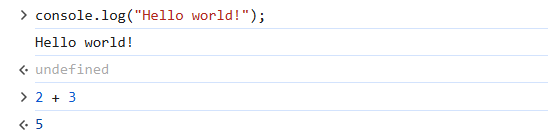
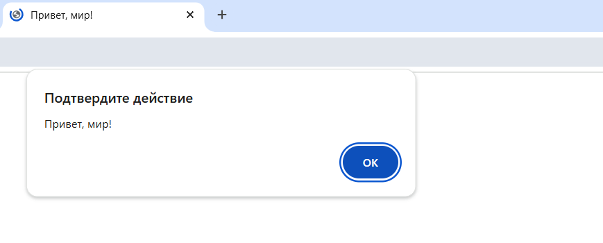
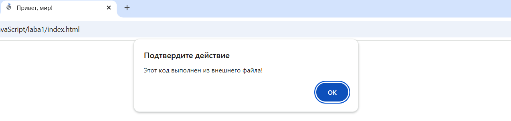
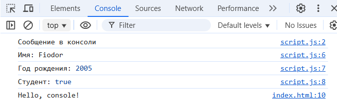
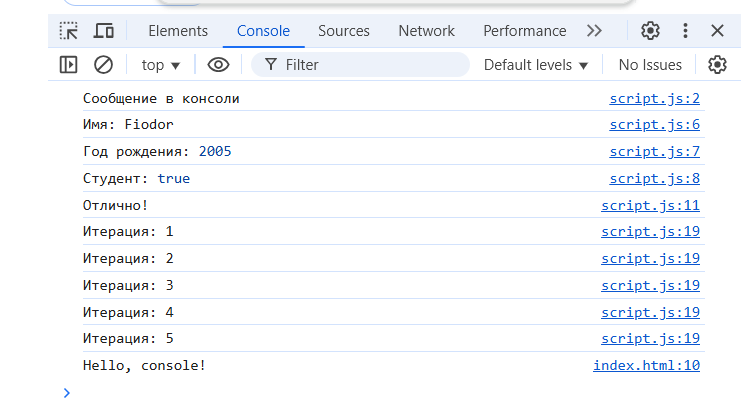

# Лабораторная работа №1. Введение в JavaScript

## Цель работы

Познакомиться с основами JavaScript, научиться писать и выполнять код в браузере и в локальной среде, разобраться с базовыми конструкциями языка.

## Ход работы:

## Задание 1. Выполнение кода в браузере

1. Выполненил код JavaScript в браузере.


### 2. Создание первой HTML-страницы с JavaScript.
Создаю файл `index.html` и вставляю в него следующий код.

 ```html
 <!DOCTYPE html>
   <html lang="en">
     <head>
       <title>Привет, мир!</title>
     </head>
     <body>
       <script>
         alert("Привет, мир!");
         console.log("Hello, console!");
       </script>
     </body>
   </html>
 ```
 Открываю `index.html` в браузере и смотрю, как выполняется код.
 

 ### 3. Подключение внешнего JavaScript-файла.
 Создаю файл script.js и добавляю в него код:
   ```javascript
   alert("Этот код выполнен из внешнего файла!");
   console.log("Сообщение в консоли");
   ```
   Подключаю файл в `index.html`, добавив в `<head>`

   ```html
   <script src="script.js"></script>
   ```
   Открываю страницу в браузере.
   

   ## Задание 2. Работа с типами данных.
1. Объявление переменных и работа с ними.

2. Управление потоком выполнения (условия и циклы).
Добавляю следующий код в `script.js`:

   ```javascript
   let score = prompt("Введите ваш балл:");
   if (score >= 90) {
     console.log("Отлично!");
   } else if (score >= 70) {
     console.log("Хорошо");
   } else {
     console.log("Можно лучше!");
   }

   for (let i = 1; i <= 5; i++) {
     console.log(`Итерация: ${i}`);
   }
   ```

 Открываю страницу в браузере и смотрю, как работают условия и циклы.
 

 ### Контрольные вопросы:
1. Чем отличается `var` от `let` и `const`?
var объявляет переменную с функциональной областью видимости и позволяет повторное объявление, что может привести к неожиданным ошибкам. let и const имеют блочную область видимости, но let позволяет изменять значение переменной, а const делает его неизменяемым.
2. Что такое неявное преобразование типов в JavaScript?
Неявное преобразование типов в JavaScript — это автоматическое приведение одного типа данных к другому при выполнении операций, например, сложение числа и строки:
3. Как работает оператор `==` в сравнении с `===`?
Оператор == выполняет неявное преобразование типов перед сравнением, тогда как === проверяет значения без изменения типов.

### Библиография:
#### https://skillbox.ru/media/code/chem_razlichayutsya_var_let_i_const_v_javascript/
#### https://habr.com/ru/companies/ruvds/articles/347866/
#### https://learn.microsoft.com/ru-ru/dotnet/csharp/language-reference/operators/comparison-operators
#### https://developer.mozilla.org/ru/docs/Web/JavaScript/Guide/Expressions_and_operators