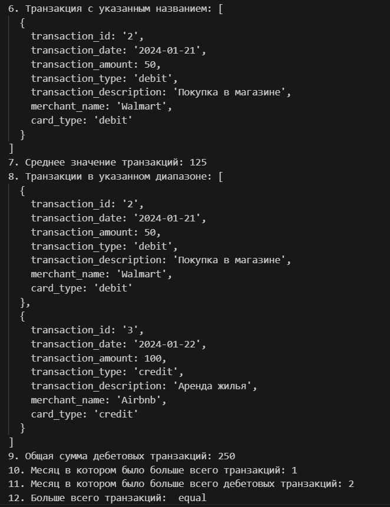
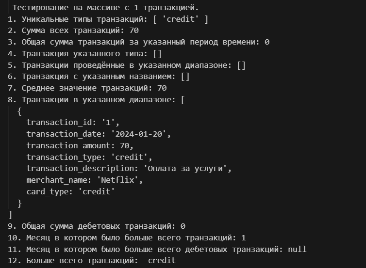

# Лабораторная работа №2. Основы работы с массивами, функциями и объектами в JavaScript

## Цель работы

Изучить основы работы с массивами и функциями в JavaScript, применяя их для обработки и анализа транзакций.

## Условие

Создать консольное приложение для анализа транзакций.

### Шаг 1. Создание массива транзакций

1. Создаю файл `main.js` для размещения кода.
2. Создаю массив объектов с транзакциями. Каждая транзакция содержит следующие свойства:

   - `transaction_id` - уникальный идентификатор транзакции.
   - `transaction_date` - дата транзакции.
   - `transaction_amount` - сумма транзакции.
   - `transaction_type` - тип транзакции (приход или расход).
   - `transaction_description` - описание транзакции.
   - `merchant_name` - название магазина или сервиса.
   - `card_type` - тип карты (credit or debit).

Пример 1 транзакции:


### Шаг 2. Реализация функций для анализа транзакций

Реализую следующие функции для анализа транзакций.

1. Функция, которая возвращает массив уникальных типов транзакций.

```JavaScript
function getUniqueTransactionTypes(transactions) {
    const types = transactions.map(tx => tx.transaction_type);
    return [...new Set(types)];
}
```

2. Функция, которая вычисляет сумму всех транзакций.

```JavaScript
function calculateTotalAmount(transactions) {
    return transactions.reduce((sum, tx) => sum + tx.transaction_amount, 0);
}
```

3. Функция, которая вычисляет общую сумму транзакций за указанный год, месяц и день.

```JavaScript
function calculateTotalAmountByDate(transactions, year, month, day) {
    return transactions.filter(tx => { const date = new Date(tx.transaction_date);

    return (!year || date.getFullYear() === year) &&
        (!month || date.getMonth() + 1 === month) &&
        (!day || date.getDate() === day);
    }).reduce((sum, tx) => sum + tx.transaction_amount, 0);
}
```
4. Функция, которая возвращает транзакции указанного типа (`debit` или `credit`).

```JavaScript
function getTransactionByType(transactions, type) {
    return transactions.filter(tx => tx.transaction_type === type);
}
```
5. Функция, которая возвращает массив транзакций, проведенных в указанном диапазоне дат от `startDate` до `endDate`.

```JavaScript
function getTransactionsInDateRange(transactions, startDate, endDate) {
    return transactions.filter(tx => {
        const date = tx.transaction_date;
        return date >= startDate && date <= endDate;
    })
}
```
6. Функция, которая возвращает массив транзакций, совершенных с указанным `merchantName`.

```JavaScript
function getTransactionsByMerchant(transactions, merchantName) {
    return transactions.filter(tx => tx.merchant_name === merchantName);
}
```
7. Функция, которая возвращает среднее значение транзакций.

```JavaScript
function calculateAverageTransactionAmount(transactions) {
    if (transactions.length === 0) return 0;
    const totalAmount = transactions.reduce((sum, tx) => sum + tx.transaction_amount, 0);
    return totalAmount / transactions.length;
}
```
8. Функция, которая возвращает массив транзакций с суммой в заданном диапазоне от `minAmount` до `maxAmount`.

```JavaScript
function getTransactionsByAmountRange(transactions, minAmount, maxAmount) {
    return transactions.filter(tx => tx.transaction_amount >= minAmount && tx.transaction_amount <= maxAmount);
}
```
9. Функция, которая вычисляет общую сумму дебетовых транзакций.

```JavaScript
function calculateTotalDebitAmount(transactions) {
    return transactions.filter(tx => tx.transaction_type === "debit")
    .reduce((sum,tx) => sum + tx.transaction_amount, 0);
}
```
10. Функция, которая возвращает месяц, в котором было больше всего транзакций.

```JavaScript
function findMostTransactionsMonth(transactions) {
    if (transactions.length === 0) {
        return null;
    }
    const months = transactions.map(transaction => new Date(transaction.transaction_date).getMonth());
    const monthCounts = months.reduce((counts, month) => {
        counts[month] = (counts[month] || 0) + 1;
        return counts;
    }, {});
    const mostTransactionsMonth = Object.keys(monthCounts).reduce((a, b) => monthCounts[a] > monthCounts[b] ? a : b);
    return parseInt(mostTransactionsMonth) + 1;
}
```
11. Функция, которая возвращает месяц, в котором было больше дебетовых транзакций.

```JavaScript
function findMostDebitTransactionMonth(transactions) {
    const debitTransactions = transactions.filter(transaction => transaction.card_type === 'debit');
    if (transactions.length === 0) {
        return null;
    }
    return findMostTransactionsMonth(debitTransactions);
}
```
12. Функция, которая возвращает каких транзакций больше всего.

```JavaScript
function mostTransactionTypes(transactions) {
    const debitCount = transactions.filter(transaction => transaction.transaction_type === 'debit').length;
    const creditCount = transactions.filter(transaction => transaction.transaction_type === 'credit').length;

    if (debitCount > creditCount) return 'debit';
    if (creditCount > debitCount) return 'credit';
    return 'equal';
}
```
13. Функция, которая возвращает массив транзакций, совершенных до указанной даты.

```JavaScript
function getTransactionsBeforeDate(transactions, date) {
    const targetDate = typeof date === "string" ? new Date(date) : date;
    return transactions.filter(tx => {
        const transactionDate = new Date(tx.transaction_date); 
        return transactionDate < targetDate;
    });
}
```
14. Функция, которая возвращает транзакцию по ее уникальному идентификатору (`id`).

```JavaScript
function findTransactionById(transactions, id) {
    return transactions.filter(tx => tx.transaction_id === id);
}
```
15. Функция, которая возвращает новый массив, содержащий только описания транзакций.

```JavaScript
function mapTransactionDescriptions(transactions) {
    return transactions.map(tx => tx.transaction_description);
}
```

### Шаг 3. Тестирование функций

1. Тестирую все функции на массиве с несколькими транзакциями.





2. Тестирую все функции на пустом массиве.


3. Тестирую все функции на массиве с 1 транзакцией.




## Контрольные вопросы 

### 1. Какие методы массивов можно использовать для обработки объектов в JavaScript?

Методы массивов для обработки объектов:

`map()`: для преобразования каждого объекта в массиве.

`filter()`: для выбора объектов, соответствующих условию.

`forEach()`: для выполнения операций над каждым объектом.

`reduce()`: для агрегирования данных (например, подсчета суммы).

`some()`, every(): для проверки условий.

`find()`: для поиска первого объекта, соответствующего условию.

`sort()`: для сортировки объектов.

### 2. Как сравнивать даты в строковом формате в JavaScript? 

Для того, чтобы сравнить даты в строковом формате строки нужно преобразовать в объекты, с помощью `new ` и тогда сравнивать.

### 3. В чем разница между map(), filter() и reduce() при работе с массивами объектов?

`map()`: создает новый массив, преобразуя каждый элемент.

`filter()`: создает новый массив, включающий только элементы, соответствующие условию.

`reduce()`: вычисляет единое значение, сводя массив к одному результату. 

#### Библиография.

#### https://learn.javascript.ru/array-methods
#### https://ru.stackoverflow.com/questions/948785/%D0%9A%D0%B0%D0%BA-%D1%81%D1%80%D0%B0%D0%B2%D0%BD%D0%B8%D1%82%D1%8C-%D1%80%D0%B0%D0%B7%D0%BD%D1%8B%D0%B5-%D1%84%D0%BE%D1%80%D0%BC%D0%B0%D1%82%D1%8B-%D0%B4%D0%B0%D1%82