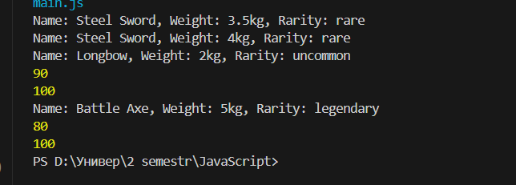

  # Лабораторная работа №3. Продвинутые объекты в JavaScript

## Цель работы

Познакомиться с классами и объектами в JavaScript, научиться создавать классы, использовать конструкторы и методы, а также реализовать наследование.

## Условие

Создайте консольное приложение, моделирующее систему инвентаря, где можно добавлять предметы, изменять их свойства и управлять ими.

### Шаг 1. Создание класса `Item`

Создайте класс `Item`, который будет представлять предмет в инвентаре.

- **Поля класса**:
  - `name` – название предмета.
  - `weight` – вес предмета.
  - `rarity` – редкость предмета (`common`, `uncommon`, `rare`, `legendary`).
- **Методы**:
  - `getInfo()` – возвращает строку с информацией о предмете.
  - `setWeight(newWeight)` – изменяет вес предмета.

  Пример использования:

```js
const sword = new Item("Steel Sword", 3.5, "rare");
console.log(sword.getInfo());
sword.setWeight(4.0);
```

### Шаг 2. Создание класса `Weapon`

Создайте класс `Weapon`, который расширяет `Item`.

- **Дополнительные поля**:
  - `damage` – урон оружия.
  - `durability` – прочность (от 0 до 100).
- **Методы**:
  - `use()` – уменьшает `durability` на 10 (если `durability > 0`).
  - `repair()` – восстанавливает `durability` до 100.

**Пример использования**:

```js
const bow = new Weapon("Longbow", 2.0, "uncommon", 15, 100);
console.log(bow.getInfo());
bow.use();
console.log(bow.durability); // должно уменьшиться
bow.repair();
```
### Шаг 3. Тестирование


### Шаг 4. Дополнительное задание
1. **Опциональная цепочка** `(?.)` – используйте ее при доступе к свойствам объекта, чтобы избежать ошибок.
```js
const axe = new WeaponConstructor("Battle Axe", 5.0, "legendary", 20, 90);
console.log(axe.getInfo?.());
axe.use?.();
console.log(axe.durability);
axe.repair?.();
console.log(axe.durability);
```
2. **Создание функции-конструктора**:
   - Перепишите классы `Item` и `Weapon`, используя **функции-конструкторы** вместо `class`.
```js
function ItemConstructor(name, weight, rarity) {
    this.name = name;
    this.weight = weight;
    this.rarity = rarity;
    
    this.getInfo = function() {
        return `Name: ${this.name}, Weight: ${this.weight}kg, Rarity: ${this.rarity}`;
    };

    this.setWeight = function(newWeight) {
        this.weight = newWeight;
    };
}
function WeaponConstructor(name, weight, rarity, damage, durability) {
    ItemConstructor.call(this, name, weight, rarity);
    this.damage = damage;
    this.durability = durability;
    
    this.use = function() {
        if (this.durability > 0) {
            this.durability -= 10;
        }
    };

    this.repair = function() {
        this.durability = 100;
    };
}
```
## Контрольные вопросы

1. Какое значение имеет `this` в методах класса?
this в методе класса ссылается на тот объект, который вызвал этот метод.
Оно позволяет получить доступ к свойствам и другим методам этого объекта
2. Как работает модификатор доступа `#` в JavaScript?
Символ # делает поле или метод приватным, то есть недоступным снаружи класса.
Это позволяет скрыть внутренние данные и защитить их от внешнего вмешательства.
3. В чем разница между `классами` и `функциями-конструкторами`?
Классы — это современный и более удобный способ создавать объекты и наследование.
Функции-конструкторы — старый способ, который требует больше ручной настройки, особенно при наследовании.
