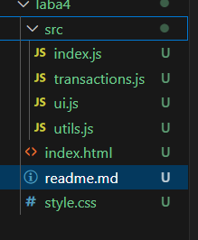

# Лабораторная работа №4. Работа с DOM-деревом и событиями в JavaScript

## Цель работы

Ознакомиться с основами взаимодействия JS с DOM-деревом на основе веб-приложения для **учета личных финансов**.

## Условия

### Шаг 1. Настройка и структурирование проекта

1. Создаю корневую папку проекта.
2. В корневой папке создаю директорию `/src`, где будет храниться весь код.
   - `index.js` – главный файл, который будет импортировать другие модули.
   - `transactions.js` – модуль для работы с массивом транзакций.
   - `ui.js` – модуль для работы с DOM (отрисовка таблицы, формы и т. д.).
   - `utils.js` – вспомогательные функции (например, генерация ID, форматирование даты).
3. Создаю `index.html` в корневой папке и подключаю `index.js` с `type="module"`.
4. Создаю `style.css` и подключаю его к HTML.


```html
<!DOCTYPE html>
<html lang="en">
<head>
  <meta charset="UTF-8">
  <meta name="viewport" content="width=device-width, initial-scale=1.0">
  <title>Личный Финансовый Трекер</title>
  <link rel="stylesheet" href="style.css">
</head>
<body>
  <h1>Финансовый Трекер</h1>
  <form id="transaction-form">
    <input type="number" id="amount" placeholder="Сумма" required>
    <select id="category" required>
      <option value="Доход">Доход</option>
      <option value="Расход">Расход</option>
    </select>
    <input type="text" id="description" placeholder="Описание" required>
    <button type="submit">Добавить</button>
  </form>
  <table id="transaction-table">
    <thead>
      <tr>
        <th>Дата и Время</th>
        <th>Категория</th>
        <th>Описание</th>
        <th>Действие</th>
      </tr>
    </thead>
    <tbody>
      <!-- Строки транзакций добавляются сюда -->
    </tbody>
  </table>
  <div id="transaction-details"></div>
  <div id="total-sum">Общая сумма: 0</div>
  <script type="module" src="src/index.js"></script>
</body>
</html>
```

### Шаг 2. Представление транзакции

```js
const transactions = [];

export function addTransactionToArray(amount, category, description) {
  const transaction = {
    id: Date.now().toString(),
    date: new Date().toLocaleString(),
    amount,
    category,
    description
  };
  transactions.push(transaction);
  return transaction;
}

export function getTransactions() {
  return transactions;
}

export function deleteTransactionFromArray(id) {
  const index = transactions.findIndex((t) => t.id === id);
  if (index !== -1) transactions.splice(index, 1);
}
```

### Шаг 3. Отображение транзакций

```js
export function renderTransactionTable(transaction, tableElement) {
  const row = document.createElement('tr');
  row.dataset.id = transaction.id;

  row.innerHTML = `
    <td>${transaction.date}</td>
    <td>${transaction.category}</td>
    <td>${transaction.description.split(' ').slice(0, 4).join(' ')}...</td>
    <td><button class="delete-btn">Удалить</button></td>
  `;

  row.classList.add(transaction.amount > 0 ? 'green' : 'red');
  tableElement.appendChild(row);
}

export function renderTransactionDetails(transaction, detailsElement) {
  detailsElement.textContent = `Дата: ${transaction.date}, Категория: ${transaction.category}, Описание: ${transaction.description}`;
}

```

### Шаг 4. Добавление транзакций

```js
transactionForm.addEventListener('submit', (e) => {
  e.preventDefault();

  const amountInput = document.getElementById('amount');
  const categoryInput = document.getElementById('category');
  const descriptionInput = document.getElementById('description');

  const amount = parseFloat(amountInput.value);
  const category = categoryInput.value;
  const description = descriptionInput.value;

  if (!amount || !category || !description) {
    alert('Пожалуйста, заполните все поля!');
    return;
  }

  const newTransaction = addTransactionToArray(amount, category, description);

  renderTransactionTable(newTransaction, transactionTable);
  updateTotalSum(getTransactions(), totalSumElement);

  transactionForm.reset();
});

```
### Шаг 5. Управление транзакциями

```js
transactionTable.addEventListener('click', (e) => {
  if (e.target.classList.contains('delete-btn')) {
    const row = e.target.closest('tr');
    const transactionId = row.dataset.id;

    deleteTransactionFromArray(transactionId);
    row.remove();

    updateTotalSum(getTransactions(), totalSumElement);
  }
});

```
### Шаг 6. Подсчет суммы транзакции

```js
export function updateTotalSum(transactions, totalSumElement) {
  const total = transactions.reduce((sum, transaction) => {
    return sum + (transaction.category === 'Доход' ? transaction.amount : -transaction.amount);
  }, 0);
  totalSumElement.textContent = `Общая сумма: ${total.toFixed(2)}`;
}

```
### Шаг 7. Отображение полное транзакции

```js
transactionTable.addEventListener('click', (e) => {
  if (e.target.tagName === 'TD' && !e.target.classList.contains('delete-btn')) {
    const row = e.target.closest('tr');
    const transactionId = row.dataset.id;

    const transaction = getTransactions().find((t) => t.id === transactionId);
    renderTransactionDetails(transaction, transactionDetailsElement);
  }
});

```
### Шаг 8. Добавление транзакции

Проверка ошибок 

```html
<div>
  <input type="number" id="amount" placeholder="Сумма" required>
  <span id="amount-error" class="error"></span>
</div>
<div>
  <select id="category" required>
    <option value="">Выберите категорию</option>
    <option value="Доход">Доход</option>
    <option value="Расход">Расход</option>
  </select>
  <span id="category-error" class="error"></span>
</div>
<div>
  <input type="text" id="description" placeholder="Описание" required>
  <span id="description-error" class="error"></span>
</div>

```
## Контрольные вопросы

### Каким образом можно получить доступ к элементу на веб-странице с помощью JavaScript?

Получение элемента: Доступ к элементу на веб-странице можно получить с помощью методов, 
таких как document.getElementById, document.querySelector, или document.querySelectorAll.

### Что такое делегирование событий и как оно используется для эффективного управления событиями на элементах DOM?

Делегирование событий: Делегирование событий — это техника, позволяющая добавлять 
обработчики событий на родительский элемент, чтобы обработать события на дочерних элементах,
используя всплытие событий.

### Как можно изменить содержимое элемента DOM с помощью JavaScript после его выборки?
Изменение содержимого: Содержимое элемента DOM можно изменить с помощью свойства innerHTML, 
textContent или методов, например, appendChild.

### Как можно добавить новый элемент в DOM дерево с помощью JavaScript?
Добавление элемента: Новый элемент можно добавить в DOM с помощью методов document.createElement для 
создания элемента и appendChild или insertBefore для добавления его в дерево.